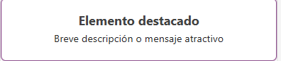

# Power-Apps
### documentación
---

# Creacion de la aplicacón 

### Conectar los Datos y preparar el entorno

1. Le damos a crear
   
2. Le damos


3. le damos 


4. Buscamos este icono y le damos + Agregar Datos


5. Escribimos Excel y  le damos Excel Online (Empresas)


6. Luego le damos en OneDrove for Business
   


7. Luego le damos en Documentos
   


8. luego le damos el archivo que habia creado llamado Datos.slsx


9. luego selecionamos todas las tablas y le damos Conectar


 
10. Lo dejamos asi y le damos Conectar
    


---

### MENU


1. Le damos a crear Nueva Pantalla y Seleccionamos Pantalla de Bienvenida


2. seleccionamos el encabezado y seleccionamos propiedades 


* En el titulo Ponemos EL nombre de Aplicacion y una bienvenida
* Tambien selecionamos una imagen para el logo


* Selecionamos esta paleta de colores
* Rellenamos con rojo oscuro
* ponemos esta fuente Lato Black
  


* Debe verse asi


---

3. vamos a crear un boton para poder dezplarnos entre plantillas

* Crearemos el boton de los empleados
 
* luego seleccionamos la imagen de los conetenedores para darle estilo 


* le damos CONTROL X


* luego le damos al + y busacos un icono de personas
* vamos darle el tamaño y configuarmos asi


* vamos darle el color
  
   
  
* luego vamos a configurar en Avanzado, OnSelect y colocamos esto

```
Navigate('Listas de empleados'; ScreenTransition.Fade) // lo que se puede modificar para las demas botones
es lo de la lista de empleados por el otro nombre de la plantilla
```
--- 
* ### vamos configurar el  boton en el elemento destacado



* le cambiamos el texto y lo dejamos asi en las seccion general

  
  
* luego solo cambiamos en tamaño de la fuente por 25 y el espersor de la fuente por negrita
* luego vamos a configurar en Avanzado, OnSelect y colocamos esto

```
Navigate('Listas de empleados'; ScreenTransition.Fade) // lo que se puede modificar para los demas botones
es lo de la lista de empleados por el otro nombre de la plantilla
```

* Deberia verse asi


---
4. luego se repite los mismos pasos para la configfuracion de aspecto y diseño para los botones de Evaluaciones, Eventos-Calendario y Candidatos

* en la configuracion para poder desplasarnos entre plantillas se cambia por el nombre de la plantilla que queremos ir

* Evaluaciones
* vamos a configurar en Avanzado, OnSelect y colocamos esto

```
Navigate(Evaluaciones; ScreenTransition.Fade) // lo que se puede modificar para los demas botones
es lo de la "Evaluaciones" por el otro nombre de la plantilla
```

* Eventos-Calendario
* vamos a configurar en Avanzado, OnSelect y colocamos esto

```
Navigate(Eventos; ScreenTransition.Fade) // lo que se puede modificar para los demas botones
es lo de la "Eventos" por el otro nombre de la plantilla
```

* Candidatos
* vamos a configurar en Avanzado, OnSelect y colocamos esto

```
Navigate(Candidatos; ScreenTransition.Fade) // lo que se puede modificar para los demas botones
es lo de la "Canditos" por el otro nombre de la plantilla
```

* Asi se ve La Plantilla de Bienvenidad


