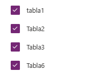
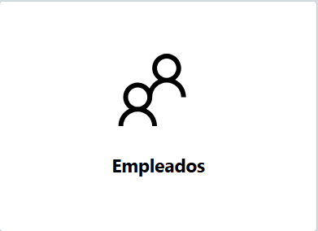
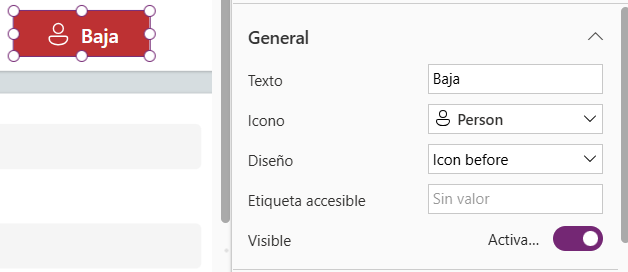

# Power-Apps
### documentación
---

# Creacion de la aplicacón 

### Conectar los Datos y preparar el entorno

1. Le damos a crear
   
2. Le damos


3. le damos 


4. Buscamos este icono y le damos + Agregar Datos


5. Escribimos Excel y  le damos Excel Online (Empresas)


6. Luego le damos en OneDrove for Business
   


7. Luego le damos en Documentos
   


8. luego le damos el archivo que habia creado llamado Datos.slsx


9. luego selecionamos todas las tablas y le damos Conectar


 
10. Lo dejamos asi y le damos Conectar
    


---

### MENU


1. Le damos a crear Nueva Pantalla y Seleccionamos Pantalla de Bienvenida


2. seleccionamos el encabezado y seleccionamos propiedades 


* En el titulo Ponemos EL nombre de Aplicacion y una bienvenida
* Tambien selecionamos una imagen para el logo


* Selecionamos esta paleta de colores
* Rellenamos con rojo oscuro
* ponemos esta fuente Lato Black
  


* Debe verse asi


---

* Vamos a configurar el color delos contenedores
* Los seleccionamos y en propiedades elegimos el color
  


---

3. vamos a crear un boton para poder dezplarnos entre plantillas

* Crearemos el boton de los empleados
 
* luego seleccionamos la imagen de los conetenedores para darle estilo 


* le damos CONTROL X


* luego le damos al + y busacos un icono de personas
* vamos darle el tamaño y configuarmos asi


* vamos darle el color
  
   
  
* luego vamos a configurar en Avanzado, OnSelect y colocamos esto

```
Navigate('Listas de empleados'; ScreenTransition.Fade) // lo que se puede modificar para las demas botones
es lo de la lista de empleados por el otro nombre de la plantilla
```
--- 
* ### vamos configurar el  boton en el elemento destacado


* le cambiamos el texto y lo dejamos asi en las seccion general

  
  
* luego solo cambiamos en tamaño de la fuente por 25 y el espersor de la fuente por negrita
* luego vamos a configurar en Avanzado, OnSelect y colocamos esto

```
Navigate('Listas de empleados'; ScreenTransition.Fade) // lo que se puede modificar para los demas botones
es lo de la lista de empleados por el otro nombre de la plantilla
```

* Deberia verse asi




---

4. luego se repite los mismos pasos para la configfuracion de aspecto y diseño para los botones de Evaluaciones, Eventos-Calendario y Candidatos

* en la configuracion para poder desplasarnos entre plantillas se cambia por el nombre de la plantilla que queremos ir

* Evaluaciones
* vamos a configurar en Avanzado, OnSelect y colocamos esto

```
Navigate(Evaluaciones; ScreenTransition.Fade) // lo que se puede modificar para los demas botones
es lo de la "Evaluaciones" por el otro nombre de la plantilla
```

* Eventos-Calendario
* vamos a configurar en Avanzado, OnSelect y colocamos esto

```
Navigate(Eventos; ScreenTransition.Fade) // lo que se puede modificar para los demas botones
es lo de la "Eventos" por el otro nombre de la plantilla
```

* Candidatos
* vamos a configurar en Avanzado, OnSelect y colocamos esto

```
Navigate(Candidatos; ScreenTransition.Fade) // lo que se puede modificar para los demas botones
es lo de la "Canditos" por el otro nombre de la plantilla
```

* Asi se ve La Plantilla de Bienvenidad


---

### Listas de Empleados

1. creamos una nueva plantilla


2. le cambiamos el nombre a la pantalla y configuramos el encabezado   


* selecionamos el encabezado y lo configuramos de esta manera, tambien en rellenar seleccinamos Rojo oscuro


3. seleccionamos y le cambiamos el color del contenedor


4. Vamos a configurar la tabla para que nos muestre Los Datos de Tabla1

* Vamos a quitar esto
  


* CONTROL + X DOS veces para quitar tambien el contenedor 
   
* Seleccionamos la tabla y le damos a  Datos
* luego seleccionamos Tabla1 y le damos a Reemplazar columnas
  


* ### Si nos aparece esto debemos cambiar las tablas que tiene predetermidas por las nuestra (Tabla1)


* Asi

```
Remove(
    Table1;
    selectedRecord
);;
If(
    IsEmpty(
        Errors(
            Table1;
            selectedRecord
        )
    );
    UpdateContext(
        {
            CurrentItem: First(Table1);
            isItemSelected: false;
            newMode: false;
            deleteMode: false
        }
    )
);;
```
5. vamos a configuar el formulario para que nos muestres los campos y podamos crear, editar y eliminar un usuario

* Seleccionamos el formulario y le damos a  Datos
* luego seleccionamos Tabla1 y le damos a Reemplazar columnas
  


* Agregamos todos los campos en el formulario
  
  

6. Vamos a configurar los Botones

* vamos a cambiarle el texto de estos botones: Nuevo, Editar, Borrar, Cancelar y Aceptar
  


* Cambiamos el texto en propiedades


* vamos a configurar un texto y estos botones: Borrar y Cancelar


* El tamaño de la Fuente se cambia:28, el color de Fuente del texto se cambia por color Rojo oscuro y el texto por:

```
Estas seguro de borrar este empleado?
```
* El tamaño de la fuente es:22, el espezor de la fuente es :Borrar-negrita, Cancelar_seminegrita, la fuente por Open Sans

7. vamos a crear un boton que nos lleve al menu de inicio
   
* insertamos un icono de inicio, ponemos de rellenar blanco, de tamaño 52 de alto, de ancho 64 y ajustamos en la parte superior del encabezado
* insertamos un texto le ponemos inicio, sin rellenar, el tamaño de la fuente 24 y ajustamos al pie del icono de inicio


8.creamos un boton de baja para los empleados(esto no debe ir en las demas platillas)
*insertamos un boton y lo configuramos asi 



* vamos a configurar en Avanzado, OnSelect y colocamos esto

```
Navigate(Bajas; ScreenTransition.Fade) // lo que se puede modificar para los demas botones
es lo de la "Bajas" por el otro nombre de la plantilla
```
---

### Evaluaciones 
* vamos a utilizar tambien la misma plantilla y se repìte todo es proceso del aspecto de la plantilla 
*se cambia cambia los origenes de los datos en las tablas y  en los formularios, tambien los campos de los datos, el nombre de la plantilla para poder utilizar los botones de desplazamiento.
